# Custom Ceramic Mug Landing Page Fullstack Architecture Document

## Introdu         Web    AP```mermaid
graph TB
        Web --> API[⚡ Next.js API Routes]
    
    API --> DB[(🗄️ Supabase PostgreSQL)]
    Web --> Analytics[📊 Google Analytics][👤 User] --> CDN[🌐 Vercel CDN]
    CDN --> Web[📱 Next.js Web App]
    Web --> ThreeJS[🎨 Three.js 3D Designer]
    Web --> API[⚡ Next.js API Routes]
    
    API --> DB[(🗄️ Supabase PostgreSQL)]
    Web --> Analytics[📊 Google Analytics]
    
    ThreeJS --> GPU[🖥️ WebGL/GPU]
    
    subgraph "Vercel Platform"
        Web
        API
        CDN
    end
    
    subgraph "Supabase Platform"
        DB
    end
```ase PostgreSQL)]
    Web --> Analytics[📊 Google Analytics]
    
    ThreeJS --> GPU[🖥️ WebGL/GPU]
    
    subgraph "Vercel Platform"
        Web
        API
        CDN
    end
    
    subgraph "Supabase Platform"
        DB
    endS[🎨 Three.js 3D Designer]
    Web --> API[⚡ Next.js API Routes]
    
    API --> DB[(🗄️ Supabase PostgreSQL)]
    Web --> Analytics[📊 Google Analytics] --> API[⚡ Next.js API Routes]
    
    API --> DB[(🗄️ Supabase PostgreSQL)]
    Web --> Analytics[📊 Google Analytics] --> API[⚡ Next.js API Routes]
    
    API --> DB[(🗄️ Supabase PostgreSQL)]
    Web --> Analytics[📊 Google Analytics]n

This document outlines the complete fullstack architecture for Custom Ceramic Mug Landing Page, including backend systems, frontend implementation, and their integration. It serves as the single source of truth for AI-driven development, ensuring consistency across the entire technology stack.

This unified approach combines what would traditionally be separate backend and frontend architecture documents, streamlining the development process for modern fullstack applications where these concerns are increasingly intertwined.

### Starter Template Assessment

**Decision:** N/A - Greenfield project (proceeding with custom architecture)

After reviewing the PRD and documentation, this appears to be a **greenfield project** with no existing starter templates mentioned. However, given the specific requirements for 3D visualization and lead generation, I would recommend considering:

1. **Next.js + Three.js starter** - For React-based 3D web applications
2. **T3 Stack** - TypeScript, Next.js, tRPC, Prisma for fullstack type safety
3. **Vercel + Supabase template** - For rapid deployment with integrated backend services

### Architecture Summary

**Current Version (v2.0 - Epic 8 AI Generation Pivot):**

This architecture combines a modern React-based frontend with **AI-powered mug design generation** via Google AI Studio (Gemini 2.5 Flash Image), backed by a serverless API layer for lead capture and design storage. The system prioritizes mobile-first performance, rapid deployment, cost-effective AI usage with multi-layer rate limiting, and conversion optimization to meet the goal of generating 50+ leads within 3 months.

**Key Integration Points:**
- Frontend React app communicates with serverless API endpoints
- AI Generation Engine creates textures via text-to-image or image-to-image modes
- Multi-layer rate limiting (localStorage, IP-based, global) prevents API abuse
- Design state includes AI metadata (prompts, generation method) for analytics
- Lead capture integrates Google Analytics for conversion tracking and AI feature adoption metrics
- Supabase PostgreSQL stores lead data, design configurations, and rate limiting counters
- Manual upload preserved as fallback mechanism when AI unavailable

**Major Change (v2.0):** Deprecated Three.js/WebGL 3D Designer Engine → Google AI Studio AI Generation Engine

### Change Log

| Date | Version | Description | Author |
|------|---------|-------------|---------|
| 2025-09-25 | v1.0 | Initial architecture creation | Winston (Architect) |
| 2025-10-09 | v2.0 | **Epic 8: AI Generation Pivot** - Replaced Three.js 3D Designer Engine with Google AI Studio (Gemini 2.5 Flash Image) AI Generation Engine. Major architectural changes: deprecated WebGL/GPU rendering, added text-to-image and image-to-image AI generation, implemented 3-layer rate limiting (session/IP/global), added `ai_generation_limits` and `ai_generation_global_counter` database tables, updated Design data model with AI fields (generationMethod, aiPrompt, baseImageUrl), created Rate Limiter Service component, updated all workflows to reflect AI-first approach with manual upload as fallback. | Winston (Architect) |

## High Level Architecture

### Technical Summary

The system follows a **Jamstack architecture** with serverless backend services, deployed on Vercel with Supabase for database and authentication. The frontend is a Next.js React application featuring **AI-powered mug design generation** via Google AI Studio (Gemini 2.5 Flash Image), enabling users to create custom textures through text prompts or image enhancement. The backend consists of serverless API routes handling AI generation requests, lead capture, design persistence, and analytics integration. This architecture achieves the PRD goals through AI-powered creative experiences that convert visitors into qualified leads at the target 8-12% conversion rate.

### Platform and Infrastructure Choice

Based on the PRD requirements for rapid market validation, mobile-first performance, and cost-effective scaling, I'm presenting these platform options:

**Option 1: Vercel + Supabase (Recommended)**
- **Pros:** Instant deployment, built-in CDN, excellent Next.js integration, managed database with real-time capabilities, integrated auth
- **Cons:** Vendor lock-in, serverless function limits, higher costs at scale
- **Best for:** Rapid development and validation phase

**Option 2: AWS Full Stack**
- **Pros:** Complete control, cost-effective at scale, extensive service ecosystem
- **Cons:** Higher complexity, longer setup time, requires DevOps expertise
- **Best for:** Long-term scalability and enterprise requirements

**Option 3: Netlify + Firebase**
- **Pros:** Excellent frontend deployment, Google ecosystem integration, real-time database
- **Cons:** Less Next.js optimization than Vercel, Firebase complexity for simple use cases

**Recommendation:** **Vercel + Supabase** for optimal development velocity and built-in performance optimizations crucial for 3D mobile experiences.

**Platform:** Vercel  
**Key Services:** Supabase (PostgreSQL), Vercel Edge Functions, Vercel Analytics, Supabase Auth  
**Deployment Host and Regions:** Global CDN with primary edge in North America/Europe

### Repository Structure

**Structure:** Monorepo using npm workspaces  
**Monorepo Tool:** npm workspaces (lightweight, no additional tooling overhead)  
**Package Organization:** Apps (web, api) + shared packages (types, UI components, utilities)

**Rationale:** Monorepo enables shared TypeScript interfaces between frontend and backend, critical for type-safe 3D designer state and lead capture data. npm workspaces chosen over Turborepo/Nx for simplicity during market validation phase.

### High Level Architecture Diagram

```mermaid
graph TB
    User[👤 User] --> CDN[🌐 Vercel CDN]
    CDN --> Web[📱 Next.js Web App]
    Web --> AIGen[🤖 AI Generation Engine]
    Web --> API[⚡ Next.js API Routes]

    API --> GoogleAI[🎨 Google AI Studio API]
    API --> DB[(🗄️ Supabase PostgreSQL)]
    Web --> Analytics[📊 Google Analytics]

    GoogleAI --> AIGen

    subgraph "Vercel Platform"
        Web
        API
        CDN
    end

    subgraph "Supabase Platform"
        DB
    end

    subgraph "Google AI Services"
        GoogleAI
    end
```



### Architectural Patterns

- **Jamstack Architecture:** Static site generation with serverless APIs - _Rationale:_ Optimal performance and scalability for AI-powered design generation
- **Component-Based UI:** Reusable React components with TypeScript - _Rationale:_ Maintainability and type safety across AI generation UI and form components
- **Repository Pattern:** Abstract data access logic - _Rationale:_ Enables testing and future database migration flexibility
- **API-First Design:** Well-defined API contracts between frontend and backend - _Rationale:_ Supports mobile app expansion and third-party AI service integrations
- **Multi-Layer Rate Limiting:** Client-side (localStorage), IP-based (Supabase), and global (server-side) limits - _Rationale:_ Prevents API abuse while staying within Google AI Studio free tier (1,500 requests/day)
- **Progressive Enhancement:** Core functionality with manual upload fallback, enhanced with AI generation - _Rationale:_ Reliability and graceful degradation when AI service unavailable
- **Event-Driven Analytics:** User interactions trigger analytics events - _Rationale:_ Detailed conversion funnel tracking and AI feature usage monitoring

## Tech Stack

This is the **DEFINITIVE** technology selection for the entire project. All development must use these exact versions and tools.

### Technology Stack Table

| Category | Technology | Version | Purpose | Rationale |
|----------|------------|---------|---------|-----------|
| Frontend Language | TypeScript | 5.2+ | Type-safe frontend development | Essential for 3D state management and API integration reliability |
| Frontend Framework | Next.js | 14.0+ | React framework with SSR/SSG | Optimal performance for 3D content, built-in Vercel integration |
| UI Component Library | Tailwind CSS + Headless UI | 3.3+ / 1.7+ | Utility-first styling + accessible components | Mobile-first responsive design, rapid prototyping |
| State Management | Zustand | 4.4+ | Lightweight React state management | Perfect for 3D designer state without Redux complexity |
| Backend Language | TypeScript | 5.2+ | Type-safe API development | Shared types with frontend, reduced runtime errors |
| Backend Framework | Next.js API Routes | 14.0+ | Serverless API endpoints | Integrated fullstack framework, simplified deployment |
| API Style | REST | HTTP/1.1 | RESTful API design | Simple lead capture endpoints, familiar patterns |
| Database | Supabase PostgreSQL | 15+ | Primary data storage | Managed PostgreSQL with real-time features, built-in auth, scalable |
| Cache | Vercel Edge Cache | Built-in | Static asset and API caching | Automatic caching for 3D assets and API responses |
| Frontend Testing | Vitest + Testing Library | 1.0+ / 14.0+ | Unit and integration testing | Fast Jest alternative, React component testing |
| Backend Testing | Vitest | 1.0+ | API endpoint testing | Consistent testing framework across stack |
| E2E Testing | Playwright | 1.40+ | End-to-end testing | 3D interaction testing, mobile device simulation |
| Build Tool | Next.js | 14.0+ | Application bundling | Integrated build system with optimization |
| Bundler | Webpack (via Next.js) | 5.0+ | Module bundling | Built into Next.js, optimized for 3D assets |
| IaC Tool | Vercel CLI | Latest | Infrastructure as Code | Declarative deployment configuration |
| CI/CD | GitHub Actions | Latest | Continuous integration/deployment | Vercel integration, automated testing |
| Monitoring | Vercel Analytics + Sentry | Latest | Performance and error monitoring | Real-time insights and error tracking |
| Logging | Vercel Functions Logs | Built-in | Application logging | Integrated serverless function logging |
| CSS Framework | Tailwind CSS | 3.3+ | Utility-first CSS framework | Mobile-first responsive design |
| AI Image Generation | Google AI Studio (Gemini 2.5 Flash Image) | Latest | AI-powered texture generation | Text-to-image and image-to-image mug design creation (1,500 free requests/day) |
| Analytics | Google Analytics 4 | Latest | User behavior tracking | Conversion funnel analysis, lead attribution, AI feature usage metrics |

## Data Models

Based on the PRD requirements for lead capture with design preferences and 3D mug customization, I've identified these core business entities:

### Lead

**Purpose:** Represents a potential customer who has engaged with the 3D designer and provided contact information for follow-up.

**Key Attributes:**
- `id`: string (UUID) - Unique identifier
- `email`: string - Primary contact method (required)
- `name`: string - Full name for personalization
- `phone`: string - Optional phone contact
- `projectDescription`: string - User-provided project details
- `designId`: string - Reference to associated design
- `createdAt`: Date - Lead capture timestamp
- `source`: string - Traffic source (analytics tracking)
- `engagementLevel`: enum - Low/Medium/High based on 3D interaction

#### TypeScript Interface

```typescript
interface Lead {
  id: string;
  email: string;
  name: string;
  phone?: string;
  projectDescription: string;
  designId?: string;
  createdAt: string; // ISO string for PostgreSQL timestamp compatibility
  source: string;
  engagementLevel: 'low' | 'medium' | 'high';
  status: 'new' | 'contacted' | 'qualified' | 'converted';
}
```

#### Relationships

- One-to-One with Design (optional)
- One-to-Many with AnalyticsEvent

### Design

**Purpose:** Represents a user's AI-generated mug design including generation method, prompts, and texture configuration.

**Key Attributes:**
- `id`: string (UUID) - Unique identifier
- `mugColor`: string - Selected base color
- `generatedImageUrl`: string - AI-generated or manually uploaded image reference
- `generationMethod`: enum - 'manual' | 'text-to-image' | 'image-to-image'
- `aiPrompt`: string - User prompt for AI generation (if applicable)
- `baseImageUrl`: string - Base image for image-to-image enhancement (if applicable)
- `customText`: string - User-added text overlay
- `textFont`: string - Selected font family
- `textPosition`: object - Text positioning data
- `createdAt`: Date - Design creation timestamp
- `lastModified`: Date - Last interaction timestamp

#### TypeScript Interface

```typescript
interface Design {
  id: string;
  mugColor: string;
  generatedImageUrl?: string; // AI-generated or manually uploaded image
  generationMethod: 'manual' | 'text-to-image' | 'image-to-image';
  aiPrompt?: string; // Prompt used for AI generation
  baseImageUrl?: string; // Base image for image-to-image mode
  customText?: string;
  textFont?: string;
  textPosition?: string; // JSON string for PostgreSQL JSONB storage
  createdAt: string; // ISO string for PostgreSQL timestamp compatibility
  lastModified: string; // ISO string for PostgreSQL timestamp compatibility
  isComplete: boolean;
  generationCount?: number; // Track user's generation attempts
}
```

#### Relationships

- One-to-One with Lead (optional)
- One-to-Many with DesignHistory (for future versioning)

### AnalyticsEvent

**Purpose:** Tracks user interactions with the 3D designer for conversion funnel analysis and optimization.

**Key Attributes:**
- `id`: string (UUID) - Unique identifier  
- `sessionId`: string - Browser session identifier
- `eventType`: enum - Type of user interaction
- `eventData`: object - Event-specific data payload
- `timestamp`: Date - When event occurred
- `userAgent`: string - Device/browser information
- `leadId`: string - Associated lead (if available)

#### TypeScript Interface

```typescript
interface AnalyticsEvent {
  id: string;
  sessionId: string;
  eventType: 'page_view' | 'ai_generation_start' | 'ai_generation_success' | 'ai_generation_error' | 'color_change' | 'image_upload' | 'text_add' | 'lead_capture';
  eventData: Record<string, any>;
  timestamp: Date;
  userAgent: string;
  leadId?: string;
}
```

#### Relationships

- Many-to-One with Lead (optional)

### AIGenerationLimit

**Purpose:** Tracks IP-based and global rate limiting for AI generation requests to prevent abuse and stay within Google AI Studio free tier limits.

**Key Attributes:**
- `id`: string (UUID) - Unique identifier
- `ipAddress`: string - Client IP address
- `generationCount`: number - Number of generations for this IP today
- `dateKey`: string - Date key for daily reset (format: YYYY-MM-DD)
- `lastGenerationAt`: Date - Timestamp of last generation
- `createdAt`: Date - Record creation timestamp

#### TypeScript Interface

```typescript
interface AIGenerationLimit {
  id: string;
  ipAddress: string;
  generationCount: number;
  dateKey: string; // Format: YYYY-MM-DD
  lastGenerationAt: string; // ISO string for PostgreSQL timestamp compatibility
  createdAt: string; // ISO string for PostgreSQL timestamp compatibility
}
```

#### Database Schema (Supabase PostgreSQL)

```sql
CREATE TABLE ai_generation_limits (
  id UUID PRIMARY KEY DEFAULT gen_random_uuid(),
  ip_address TEXT NOT NULL,
  generation_count INTEGER DEFAULT 1,
  last_generation_at TIMESTAMP WITH TIME ZONE DEFAULT NOW(),
  date_key TEXT NOT NULL,
  created_at TIMESTAMP WITH TIME ZONE DEFAULT NOW(),
  UNIQUE(ip_address, date_key)
);

CREATE INDEX idx_ai_limits_ip_date ON ai_generation_limits(ip_address, date_key);

CREATE TABLE ai_generation_global_counter (
  id UUID PRIMARY KEY DEFAULT gen_random_uuid(),
  date_key TEXT NOT NULL UNIQUE,
  total_generations INTEGER DEFAULT 0,
  last_updated_at TIMESTAMP WITH TIME ZONE DEFAULT NOW(),
  created_at TIMESTAMP WITH TIME ZONE DEFAULT NOW()
);

CREATE INDEX idx_global_counter_date ON ai_generation_global_counter(date_key);
```

#### Relationships

- Standalone entity (no direct relationships to other models)

## API Specification

Since we chose REST API style, here's the OpenAPI 3.0 specification for all endpoints supporting the 3D mug customization and lead capture functionality:

```yaml
openapi: 3.0.0
info:
  title: Custom Ceramic Mug Landing Page API
  version: 1.0.0
  description: REST API for 3D mug customization lead generation platform
servers:
  - url: https://mug-landing.vercel.app/api
    description: Production API
  - url: http://localhost:3000/api
    description: Development API

paths:
  /leads:
    post:
      summary: Create new lead
      description: Capture lead information after meaningful 3D engagement
      requestBody:
        required: true
        content:
          application/json:
            schema:
              type: object
              required: [email, name, projectDescription]
              properties:
                email:
                  type: string
                  format: email
                  example: "user@example.com"
                name:
                  type: string
                  example: "John Smith"
                phone:
                  type: string
                  example: "+1-555-123-4567"
                projectDescription:
                  type: string
                  example: "Need 50 custom mugs for company event"
                designId:
                  type: string
                  format: uuid
                  example: "550e8400-e29b-41d4-a716-446655440000"
                source:
                  type: string
                  example: "google_ads"
                engagementLevel:
                  type: string
                  enum: [low, medium, high]
      responses:
        201:
          description: Lead created successfully
          content:
            application/json:
              schema:
                $ref: '#/components/schemas/Lead'
        400:
          description: Invalid input data
        500:
          description: Server error

  /designs:
    post:
      summary: Save design configuration
      description: Persist user's 3D mug customization
      requestBody:
        required: true
        content:
          application/json:
            schema:
              $ref: '#/components/schemas/DesignInput'
      responses:
        201:
          description: Design saved successfully
          content:
            application/json:
              schema:
                $ref: '#/components/schemas/Design'
        400:
          description: Invalid design data
        500:
          description: Server error

  /designs/{id}:
    get:
      summary: Retrieve design by ID
      parameters:
        - name: id
          in: path
          required: true
          schema:
            type: string
            format: uuid
      responses:
        200:
          description: Design retrieved successfully
          content:
            application/json:
              schema:
                $ref: '#/components/schemas/Design'
        404:
          description: Design not found

    put:
      summary: Update existing design
      parameters:
        - name: id
          in: path
          required: true
          schema:
            type: string
            format: uuid
      requestBody:
        required: true
        content:
          application/json:
            schema:
              $ref: '#/components/schemas/DesignInput'
      responses:
        200:
          description: Design updated successfully
          content:
            application/json:
              schema:
                $ref: '#/components/schemas/Design'
        404:
          description: Design not found

  /analytics/events:
    post:
      summary: Track user interaction event
      description: Record user interactions for conversion funnel analysis
      requestBody:
        required: true
        content:
          application/json:
            schema:
              type: object
              required: [sessionId, eventType, eventData]
              properties:
                sessionId:
                  type: string
                  example: "sess_550e8400e29b41d4"
                eventType:
                  type: string
                  enum: [page_view, mug_rotate, color_change, image_upload, text_add, lead_capture]
                eventData:
                  type: object
                  example: {"color": "blue", "interactionTime": 1500}
                leadId:
                  type: string
                  format: uuid
      responses:
        201:
          description: Event tracked successfully
        400:
          description: Invalid event data

  /upload:
    post:
      summary: Upload design image
      description: Handle user image uploads for mug customization
      requestBody:
        required: true
        content:
          multipart/form-data:
            schema:
              type: object
              properties:
                file:
                  type: string
                  format: binary
                designId:
                  type: string
                  format: uuid
      responses:
        200:
          description: File uploaded successfully
          content:
            application/json:
              schema:
                type: object
                properties:
                  url:
                    type: string
                    example: "https://storage.supabase.co/designs/image.jpg"
                  fileId:
                    type: string
        400:
          description: Invalid file or file too large
        415:
          description: Unsupported file type

components:
  schemas:
    Lead:
      type: object
      properties:
        id:
          type: string
          format: uuid
        email:
          type: string
          format: email
        name:
          type: string
        phone:
          type: string
        projectDescription:
          type: string
        designId:
          type: string
          format: uuid
        createdAt:
          type: string
          format: date-time
        source:
          type: string
        engagementLevel:
          type: string
          enum: [low, medium, high]
        status:
          type: string
          enum: [new, contacted, qualified, converted]

    Design:
      type: object
      properties:
        id:
          type: string
          format: uuid
        mugColor:
          type: string
        uploadedImageUrl:
          type: string
        customText:
          type: string
        textFont:
          type: string
        textPosition:
          type: object
          properties:
            x:
              type: number
            y:
              type: number
            rotation:
              type: number
            scale:
              type: number
        createdAt:
          type: string
          format: date-time
        lastModified:
          type: string
          format: date-time
        isComplete:
          type: boolean

    DesignInput:
      type: object
      required: [mugColor]
      properties:
        mugColor:
          type: string
        uploadedImageUrl:
          type: string
        customText:
          type: string
        textFont:
          type: string
        textPosition:
          type: object
          properties:
            x:
              type: number
            y:
              type: number
            rotation:
              type: number
            scale:
              type: number
        isComplete:
          type: boolean
```

## Components

Based on the architectural patterns, tech stack, and data models, I've identified these major logical components across the fullstack:

### AI Generation Engine

**Status:** ✅ Active (replaces deprecated 3D Designer Engine)

**Responsibility:** Core AI-powered mug texture generation using Google AI Studio (Gemini 2.5 Flash Image) for text-to-image and image-to-image design creation. Manages generation requests, rate limiting, and integration with design state management.

**Key Interfaces:**
- `generateFromText(prompt: string)` - Generate mug texture from text prompt
- `enhanceImage(baseImage: File, prompt: string)` - Enhance uploaded image with AI transformation
- `onGenerationComplete(imageUrl: string, design: Design)` - Notify parent components of successful generation
- `checkRateLimit()` - Verify user is within generation quota (3-layer rate limiting)
- `exportDesignPreview()` - Generate static image preview for lead capture

**Dependencies:** Google AI Studio API, Zustand design store, rate limiter service, analytics tracker

**Technology Stack:** TypeScript, React, Google AI Studio SDK, Zustand for state management, Supabase for rate limit storage

**Rate Limiting Strategy:**
- **Layer 1 (Session):** 5 free generations via localStorage (frictionless UX)
- **Layer 2 (IP-based):** 15 generations/day per IP (Supabase tracking)
- **Layer 3 (Global):** 1,400 total generations/day across all users (safety buffer)

---

### ~~3D Designer Engine~~ (DEPRECATED - Epic 8)

**Deprecation Status:** ⚠️ Replaced by AI Generation Engine in Epic 8

**Original Responsibility:** Three.js-based 3D mug visualization with manual texture uploads.

**Deprecation Rationale:** Pivoted to AI-powered generation for enhanced user creativity and reduced technical complexity. Manual upload functionality preserved as fallback within AI Generation Engine.

**Migration Path:**
- Manual image uploads moved to AI Generation Engine (generationMethod: 'manual')
- Three.js and React Three Fiber removed from tech stack
- Existing design data migrated via generationMethod field addition
- All WebGL/GPU rendering code removed

### Lead Capture Service

**Responsibility:** Handle lead form submission, validation, and persistence with analytics integration for conversion tracking. In the single-page UX model (Epic 4), this service supports always-visible forms without engagement-based trigger logic.

**Key Interfaces:**
- `createLead(leadData: LeadInput)` - Process and store new lead information
- `associateDesign(leadId: string, designId: string)` - Link lead with design
- `trackConversion(leadId: string, source: string)` - Record conversion event

**Dependencies:** REST API client, analytics tracker, form validation library

**Technology Stack:** Next.js API routes, Supabase client, Google Analytics, React Hook Form

**Epic 4 Simplifications:**
- Removed: FormTriggerManager component and engagement scoring algorithms
- Simplified: Form state management (no trigger timing or dismissal logic)
- Maintained: All validation, API integration, and analytics tracking

### Design Persistence Layer

**Responsibility:** Manage design state across sessions with auto-save functionality and temporary storage before lead capture.

**Key Interfaces:**
- `saveDesign(design: Design)` - Persist design to database
- `loadDesign(designId: string)` - Retrieve design by ID
- `updateDesign(designId: string, updates: Partial<Design>)` - Update existing design

**Dependencies:** Supabase database, file storage service, caching layer

**Technology Stack:** Supabase PostgreSQL, Supabase Storage, Vercel Edge Cache

### Analytics Tracking Engine

**Responsibility:** Capture user interactions with 3D designer and conversion funnel events for optimization analysis.

**Key Interfaces:**
- `trackEvent(event: AnalyticsEvent)` - Record user interaction event  
- `trackPageView(page: string, metadata: object)` - Track page navigation
- `trackConversionFunnel(step: string, metadata: object)` - Monitor conversion progress

**Dependencies:** Google Analytics, backend API, session management

**Technology Stack:** Google Analytics 4, Next.js API routes, browser session storage

### File Upload Handler

**Responsibility:** Process user image uploads with validation, optimization, and base64 encoding for AI image-to-image enhancement or manual design creation.

**Key Interfaces:**
- `uploadImage(file: File, designId: string)` - Handle image upload and processing
- `validateFile(file: File)` - Validate file type and size constraints (max 5MB, JPEG/PNG/WebP)
- `encodeToBase64(file: File)` - Convert image to base64 for Google AI Studio API
- `compressImage(file: File)` - Resize to max 1024x1024 for AI processing

**Dependencies:** Browser File API, image compression utilities

**Technology Stack:** Browser File API, Next.js API routes, canvas-based image compression

### Rate Limiter Service

**Status:** ✅ New Component (Epic 8)

**Responsibility:** Multi-layer rate limiting for AI generation requests to prevent abuse and ensure fair usage within Google AI Studio free tier (1,500 requests/day).

**Key Interfaces:**
- `checkSessionLimit()` - Verify Layer 1 (localStorage) - 5 free generations
- `checkIPLimit(ipAddress: string)` - Verify Layer 2 (Supabase) - 15/day per IP
- `checkGlobalLimit()` - Verify Layer 3 (Supabase) - 1,400/day total
- `incrementCounters(ipAddress: string)` - Update all tracking counters post-generation
- `getRemainingQuota(ipAddress: string)` - Display remaining generations to user
- `getResetTime()` - Calculate time until UTC midnight reset

**Dependencies:** Supabase database, localStorage API, IP detection utilities

**Technology Stack:** TypeScript, Supabase client, React hooks (useRateLimiter), Node.js (server-side validation)

**Database Tables:**
- `ai_generation_limits` - IP-based daily tracking
- `ai_generation_global_counter` - Global daily total

### Mobile-First UI Components

**Responsibility:** Responsive React components optimized for touch interactions and progressive enhancement across device types, featuring AI generation interface and manual upload fallback.

**Key Interfaces:**
- `<AITextureGenerator />` - Main AI generation interface with mode toggle
- `<PromptInput />` - Text prompt input with character counter (500 char limit)
- `<GenerationModeToggle />` - Switch between Manual | Text-to-Image | Image-to-Image
- `<QuotaDisplay />` - Real-time generation quota display with warnings
- `<ColorPicker />` - Touch-friendly color selection interface
- `<TextEditor />` - In-context text editing with positioning
- `<LeadCaptureForm />` - Conversion-optimized lead capture form (always visible)
- `<ImagePreview />` - Generated/uploaded image preview before application

**Dependencies:** Tailwind CSS, Headless UI, Zustand, React Hook Form

**Technology Stack:** React, TypeScript, Tailwind CSS, Headless UI, React Hook Form

### Component Diagrams

```mermaid
graph TD
    UI[Mobile-First UI Components] --> AIGen[AI Generation Engine]
    UI --> Upload[File Upload Handler]
    UI --> Lead[Lead Capture Service]

    AIGen --> RateLimit[Rate Limiter Service]
    AIGen --> Persistence[Design Persistence Layer]
    AIGen --> Analytics[Analytics Tracking Engine]
    AIGen --> API[/api/generate-texture]

    API --> GoogleAI[Google AI Studio API]
    API --> RateLimit

    RateLimit --> DB[(Supabase Database)]

    Lead --> Analytics
    Lead --> Persistence

    Upload --> AIGen
    Upload --> Persistence

    Persistence --> DB
    Analytics --> GA[Google Analytics]

    subgraph "Frontend Components"
        UI
        AIGen
    end

    subgraph "Service Layer"
        Lead
        Upload
        Analytics
        Persistence
        RateLimit
    end

    subgraph "Backend API Routes"
        API
    end

    subgraph "External Services"
        DB
        GA
        GoogleAI
    end
```

## External APIs

Based on the PRD requirements and component design, here are the external service integrations needed:

### Google AI Studio API (Gemini 2.5 Flash Image)

**Status:** ✅ Primary Integration (Epic 8)

- **Purpose:** AI-powered mug texture generation via text-to-image and image-to-image transformation
- **Documentation:** https://ai.google.dev/gemini-api/docs/imagen
- **Base URL:** https://generativelanguage.googleapis.com/v1beta/models/gemini-2.5-flash-image:generateImage
- **Authentication:** API Key (stored in `.env.local` server-side only)
- **Rate Limits:** 1,500 requests per day (free tier)
- **Pricing:** Free tier: 1,500/day | Paid: $0.039 per image (1,290 tokens @ $30/1M)

**Key Endpoints Used:**
- `POST /v1beta/models/gemini-2.5-flash-image:generateImage` - Generate texture from text prompt or enhance uploaded image

**Request Format:**
```json
{
  "prompt": "watercolor flowers on white background",
  "image": "base64_encoded_image_optional",
  "aspectRatio": "1:1",
  "numberOfImages": 1
}
```

**Response Format:**
```json
{
  "predictions": [{
    "bytesBase64Encoded": "base64_image_data",
    "mimeType": "image/jpeg"
  }]
}
```

**Integration Notes:**
- All API calls routed through `/api/generate-texture` Next.js API route (API key protection)
- Multi-layer rate limiting (session, IP-based, global) prevents abuse
- Base64 images returned and converted to data URLs for immediate use
- Typical response time: 2-4 seconds
- Built-in content filtering for inappropriate prompts/generations
- Automatic retry with exponential backoff on transient failures
- Clear error messages for quota exhaustion, network failures, invalid input

**Rate Limiting Implementation:**
1. **Layer 1 (Client):** localStorage tracks first 5 free generations
2. **Layer 2 (Server):** Supabase `ai_generation_limits` table tracks IP (max 15/day)
3. **Layer 3 (Server):** Supabase `ai_generation_global_counter` table (max 1,400/day total)

### Google Analytics 4 API

- **Purpose:** Track user behavior, AI generation engagement metrics, and conversion rates from visitors to leads
- **Documentation:** https://developers.google.com/analytics/devguides/collection/ga4
- **Base URL(s):** https://www.google-analytics.com/mp/collect
- **Authentication:** Measurement ID and API Secret
- **Rate Limits:** 2M events per property per day, 500 events per request

**Key Endpoints Used:**
- `POST /mp/collect` - Send custom events for AI generation interactions
- `POST /mp/collect` - Track conversion events for lead capture

**Integration Notes:** Will use gtag.js for client-side tracking and Measurement Protocol for server-side conversion tracking. Custom events will track AI generation attempts, success/failure rates, generation method selection (text-to-image vs image-to-image), color changes, and text additions to build detailed engagement profiles and measure AI feature adoption.

**Key AI-Related Events:**
- `ai_generation_start` - User initiates AI generation (method: text-to-image | image-to-image)
- `ai_generation_success` - Successful image generation (duration, method, prompt_length)
- `ai_generation_error` - Failed generation (error_type, layer_blocked)
- `ai_quota_warning` - User approaching rate limit (remaining_generations)
- `generation_method_toggle` - User switches generation mode

### Supabase Storage API (DEPRECATED - Epic 8)

**Status:** ⚠️ Minimal Usage (manual upload fallback only)

- **Purpose:** Handle user-uploaded images for manual mug design creation (fallback when AI unavailable)
- **Documentation:** https://supabase.com/docs/reference/javascript/storage-api
- **Base URL(s):** https://[project-ref].supabase.co/storage/v1
- **Authentication:** Service Role Key (server-side), RLS policies (client-side)
- **Rate Limits:** 100 requests per second per project

**Key Endpoints Used:**
- `POST /object/{bucket-name}/{file-path}` - Upload manual design images (rarely used)
- `GET /object/public/{bucket-name}/{file-path}` - Retrieve images for display

**Integration Notes:** With AI generation as primary method, storage usage is minimal. Images for image-to-image enhancement are base64-encoded and sent directly to Google AI Studio API (not stored in Supabase). Only manual uploads persist in storage as fallback mechanism.

### Supabase Database API

- **Purpose:** Real-time database operations for lead capture, design persistence, AI rate limiting, and analytics event storage
- **Documentation:** https://supabase.com/docs/reference/javascript/supabase-client
- **Base URL(s):** https://[project-ref].supabase.co/rest/v1
- **Authentication:** JWT tokens with Row Level Security
- **Rate Limits:** 10,000 requests per minute per project

**Key Endpoints Used:**
- `POST /rest/v1/leads` - Create new leads
- `POST /rest/v1/designs` - Save AI-generated or manual design configurations
- `POST /rest/v1/analytics_events` - Store interaction events (including AI generation events)
- `GET /rest/v1/designs?id=eq.{id}` - Retrieve saved designs
- `POST /rest/v1/ai_generation_limits` - Track IP-based rate limiting (Layer 2)
- `GET /rest/v1/ai_generation_limits?ip_address=eq.{ip}&date_key=eq.{date}` - Check IP quota
- `POST /rest/v1/ai_generation_global_counter` - Track global daily generation count (Layer 3)
- `GET /rest/v1/ai_generation_global_counter?date_key=eq.{date}` - Check global quota

**Integration Notes:** Real-time subscriptions enable live design synchronization across sessions. RLS policies ensure data privacy and security. Connection pooling optimizes performance for high-traffic periods. New rate limiting tables (`ai_generation_limits`, `ai_generation_global_counter`) implement multi-layer abuse prevention for Google AI Studio API calls. Daily automatic reset at UTC midnight via `date_key` field.

### Email Service Provider API

- **Purpose:** Send lead nurturing emails and design previews to captured leads
- **Documentation:** TBD - Recommend SendGrid, Mailgun, or Resend
- **Base URL(s):** TBD based on provider selection
- **Authentication:** API Key
- **Rate Limits:** Provider-dependent

**Key Endpoints Used:**
- `POST /v3/mail/send` - Send welcome emails with design previews
- `POST /v3/mail/send` - Send follow-up nurturing sequences

**Integration Notes:** Will be implemented after initial launch to support lead nurturing workflows. Email templates will include 3D design previews and personalized messaging based on engagement level.

## Core Workflows

Here are the critical user journeys from the PRD illustrated as sequence diagrams:

### Primary User Journey: AI-Powered Mug Design Generation to Lead Capture (Epic 8)

**Note:** This workflow reflects the Epic 8 AI Generation pivot where users create mug designs via text-to-image or image-to-image AI generation, with multi-layer rate limiting and always-visible lead form.


**Key Architectural Changes (Epic 8):**
- Replaced Three.js 3D Designer Engine with AI Generation Engine
- Added Google AI Studio API integration for texture generation
- Implemented 3-layer rate limiting (session, IP-based, global)
- Text-to-image and image-to-image generation modes
- Real-time quota display with warnings
- Manual upload preserved as fallback (not shown in primary flow)

### AI Generation Rate Limiting and Error Handling Workflow (Epic 8)


**Rate Limiting Thresholds:**
- **Layer 1 (Session):** 5 generations → triggers IP tracking
- **Layer 2 (IP):** 15 generations/day → hard block with midnight UTC reset
- **Layer 3 (Global):** 1,400 generations/day → service-wide block

**User Experience During Limits:**
- **Warnings at 3/5 (Layer 1):** "2 free generations remaining"
- **Warning at 13/15 (Layer 2):** "2 generations remaining today"
- **Global capacity at 1,200:** Admin notification (user sees normal behavior)
- **All limits show:** Time until reset in user's local timezone

### Analytics Event Processing Workflow


### Error Handling and Recovery Workflow


