# Custom Ceramic Mug Landing Page Fullstack Architecture Document

## Introdu         Web    AP```mermaid
graph TB
        Web --> API[⚡ Next.js API Routes]
    
    API --> DB[(🗄️ Supabase PostgreSQL)]
    Web --> Analytics[📊 Google Analytics][👤 User] --> CDN[🌐 Vercel CDN]
    CDN --> Web[📱 Next.js Web App]
    Web --> ThreeJS[🎨 Three.js 3D Designer]
    Web --> API[⚡ Next.js API Routes]
    
    API --> DB[(🗄️ Supabase PostgreSQL)]
    Web --> Analytics[📊 Google Analytics]
    
    ThreeJS --> GPU[🖥️ WebGL/GPU]
    
    subgraph "Vercel Platform"
        Web
        API
        CDN
    end
    
    subgraph "Supabase Platform"
        DB
    end
```ase PostgreSQL)]
    Web --> Analytics[📊 Google Analytics]
    
    ThreeJS --> GPU[🖥️ WebGL/GPU]
    
    subgraph "Vercel Platform"
        Web
        API
        CDN
    end
    
    subgraph "Supabase Platform"
        DB
    endS[🎨 Three.js 3D Designer]
    Web --> API[⚡ Next.js API Routes]
    
    API --> DB[(🗄️ Supabase PostgreSQL)]
    Web --> Analytics[📊 Google Analytics] --> API[⚡ Next.js API Routes]
    
    API --> DB[(🗄️ Supabase PostgreSQL)]
    Web --> Analytics[📊 Google Analytics] --> API[⚡ Next.js API Routes]
    
    API --> DB[(🗄️ Supabase PostgreSQL)]
    Web --> Analytics[📊 Google Analytics]n

This document outlines the complete fullstack architecture for Custom Ceramic Mug Landing Page, including backend systems, frontend implementation, and their integration. It serves as the single source of truth for AI-driven development, ensuring consistency across the entire technology stack.

This unified approach combines what would traditionally be separate backend and frontend architecture documents, streamlining the development process for modern fullstack applications where these concerns are increasingly intertwined.

### Starter Template Assessment

**Decision:** N/A - Greenfield project (proceeding with custom architecture)

After reviewing the PRD and documentation, this appears to be a **greenfield project** with no existing starter templates mentioned. However, given the specific requirements for 3D visualization and lead generation, I would recommend considering:

1. **Next.js + Three.js starter** - For React-based 3D web applications
2. **T3 Stack** - TypeScript, Next.js, tRPC, Prisma for fullstack type safety
3. **Vercel + Supabase template** - For rapid deployment with integrated backend services

### Architecture Summary

This architecture combines a modern React-based frontend with Three.js for 3D visualization, backed by a serverless API layer for lead capture and design storage. The system prioritizes mobile-first performance, rapid deployment, and cost-effective scaling to meet the goal of generating 50+ leads within 3 months.

**Key Integration Points:**
- Frontend React app communicates with serverless API endpoints
- 3D designer stores temporary designs in browser, persists final designs via API
- Lead capture integrates Google Analytics for conversion tracking
- MongoDB stores lead data and associated design preferences

### Change Log

| Date | Version | Description | Author |
|------|---------|-------------|---------|
| 2025-09-25 | v1.0 | Initial architecture creation | Winston (Architect) |

## High Level Architecture

### Technical Summary

The system follows a **Jamstack architecture** with serverless backend services, deployed on Vercel with Supabase for database and authentication. The frontend is a Next.js React application featuring Three.js for 3D mug visualization, optimized for mobile-first interactions. The backend consists of serverless API routes handling lead capture, design persistence, and analytics integration. This architecture achieves the PRD goals through performance-optimized 3D experiences that convert visitors into qualified leads at the target 8-12% conversion rate.

### Platform and Infrastructure Choice

Based on the PRD requirements for rapid market validation, mobile-first performance, and cost-effective scaling, I'm presenting these platform options:

**Option 1: Vercel + Supabase (Recommended)**
- **Pros:** Instant deployment, built-in CDN, excellent Next.js integration, managed database with real-time capabilities, integrated auth
- **Cons:** Vendor lock-in, serverless function limits, higher costs at scale
- **Best for:** Rapid development and validation phase

**Option 2: AWS Full Stack**
- **Pros:** Complete control, cost-effective at scale, extensive service ecosystem
- **Cons:** Higher complexity, longer setup time, requires DevOps expertise
- **Best for:** Long-term scalability and enterprise requirements

**Option 3: Netlify + Firebase**
- **Pros:** Excellent frontend deployment, Google ecosystem integration, real-time database
- **Cons:** Less Next.js optimization than Vercel, Firebase complexity for simple use cases

**Recommendation:** **Vercel + Supabase** for optimal development velocity and built-in performance optimizations crucial for 3D mobile experiences.

**Platform:** Vercel  
**Key Services:** Supabase (PostgreSQL), Vercel Edge Functions, Vercel Analytics, Supabase Auth  
**Deployment Host and Regions:** Global CDN with primary edge in North America/Europe

### Repository Structure

**Structure:** Monorepo using npm workspaces  
**Monorepo Tool:** npm workspaces (lightweight, no additional tooling overhead)  
**Package Organization:** Apps (web, api) + shared packages (types, UI components, utilities)

**Rationale:** Monorepo enables shared TypeScript interfaces between frontend and backend, critical for type-safe 3D designer state and lead capture data. npm workspaces chosen over Turborepo/Nx for simplicity during market validation phase.

### High Level Architecture Diagram

```mermaid
graph TB
    User[👤 User] --> CDN[🌐 Vercel CDN]
    CDN --> Web[📱 Next.js Web App]
    Web --> ThreeJS[🎨 Three.js 3D Designer]
    Web --> API[⚡ Next.js API Routes]
    
    API --> DB[(� SQLite Database)]
    Web --> Analytics[📊 Google Analytics]
    
    ThreeJS --> GPU[🖥️ WebGL/GPU]
    
    subgraph "Vercel Platform"
        Web
        API
        CDN
        DB
    end
```



### Architectural Patterns

- **Jamstack Architecture:** Static site generation with serverless APIs - _Rationale:_ Optimal performance and scalability for content-heavy applications with 3D interactivity
- **Component-Based UI:** Reusable React components with TypeScript - _Rationale:_ Maintainability and type safety across 3D designer and form components
- **Repository Pattern:** Abstract data access logic - _Rationale:_ Enables testing and future database migration flexibility
- **API-First Design:** Well-defined API contracts between frontend and backend - _Rationale:_ Supports mobile app expansion and third-party integrations
- **Progressive Enhancement:** Core functionality works without JavaScript, enhanced with 3D features - _Rationale:_ Accessibility and performance for diverse mobile devices
- **Event-Driven Analytics:** User interactions trigger analytics events - _Rationale:_ Detailed conversion funnel tracking for optimization

## Tech Stack

This is the **DEFINITIVE** technology selection for the entire project. All development must use these exact versions and tools.

### Technology Stack Table

| Category | Technology | Version | Purpose | Rationale |
|----------|------------|---------|---------|-----------|
| Frontend Language | TypeScript | 5.2+ | Type-safe frontend development | Essential for 3D state management and API integration reliability |
| Frontend Framework | Next.js | 14.0+ | React framework with SSR/SSG | Optimal performance for 3D content, built-in Vercel integration |
| UI Component Library | Tailwind CSS + Headless UI | 3.3+ / 1.7+ | Utility-first styling + accessible components | Mobile-first responsive design, rapid prototyping |
| State Management | Zustand | 4.4+ | Lightweight React state management | Perfect for 3D designer state without Redux complexity |
| Backend Language | TypeScript | 5.2+ | Type-safe API development | Shared types with frontend, reduced runtime errors |
| Backend Framework | Next.js API Routes | 14.0+ | Serverless API endpoints | Integrated fullstack framework, simplified deployment |
| API Style | REST | HTTP/1.1 | RESTful API design | Simple lead capture endpoints, familiar patterns |
| Database | Supabase PostgreSQL | 15+ | Primary data storage | Managed PostgreSQL with real-time features, built-in auth, scalable |
| Cache | Vercel Edge Cache | Built-in | Static asset and API caching | Automatic caching for 3D assets and API responses |
| Frontend Testing | Vitest + Testing Library | 1.0+ / 14.0+ | Unit and integration testing | Fast Jest alternative, React component testing |
| Backend Testing | Vitest | 1.0+ | API endpoint testing | Consistent testing framework across stack |
| E2E Testing | Playwright | 1.40+ | End-to-end testing | 3D interaction testing, mobile device simulation |
| Build Tool | Next.js | 14.0+ | Application bundling | Integrated build system with optimization |
| Bundler | Webpack (via Next.js) | 5.0+ | Module bundling | Built into Next.js, optimized for 3D assets |
| IaC Tool | Vercel CLI | Latest | Infrastructure as Code | Declarative deployment configuration |
| CI/CD | GitHub Actions | Latest | Continuous integration/deployment | Vercel integration, automated testing |
| Monitoring | Vercel Analytics + Sentry | Latest | Performance and error monitoring | Real-time insights and error tracking |
| Logging | Vercel Functions Logs | Built-in | Application logging | Integrated serverless function logging |
| CSS Framework | Tailwind CSS | 3.3+ | Utility-first CSS framework | Mobile-first responsive design |
| 3D Graphics | Three.js + React Three Fiber | 0.156+ / 8.15+ | 3D visualization engine | WebGL-based 3D mug rendering and interaction |
| Analytics | Google Analytics 4 | Latest | User behavior tracking | Conversion funnel analysis, lead attribution |

## Data Models

Based on the PRD requirements for lead capture with design preferences and 3D mug customization, I've identified these core business entities:

### Lead

**Purpose:** Represents a potential customer who has engaged with the 3D designer and provided contact information for follow-up.

**Key Attributes:**
- `id`: string (UUID) - Unique identifier
- `email`: string - Primary contact method (required)
- `name`: string - Full name for personalization
- `phone`: string - Optional phone contact
- `projectDescription`: string - User-provided project details
- `designId`: string - Reference to associated design
- `createdAt`: Date - Lead capture timestamp
- `source`: string - Traffic source (analytics tracking)
- `engagementLevel`: enum - Low/Medium/High based on 3D interaction

#### TypeScript Interface

```typescript
interface Lead {
  id: string;
  email: string;
  name: string;
  phone?: string;
  projectDescription: string;
  designId?: string;
  createdAt: string; // ISO string for PostgreSQL timestamp compatibility
  source: string;
  engagementLevel: 'low' | 'medium' | 'high';
  status: 'new' | 'contacted' | 'qualified' | 'converted';
}
```

#### Relationships

- One-to-One with Design (optional)
- One-to-Many with AnalyticsEvent

### Design

**Purpose:** Represents a user's 3D mug customization including uploaded images, colors, and text configuration.

**Key Attributes:**
- `id`: string (UUID) - Unique identifier
- `mugColor`: string - Selected base color
- `uploadedImageUrl`: string - User-uploaded image reference
- `customText`: string - User-added text
- `textFont`: string - Selected font family
- `textPosition`: object - 3D positioning data
- `createdAt`: Date - Design creation timestamp
- `lastModified`: Date - Last interaction timestamp

#### TypeScript Interface

```typescript
interface Design {
  id: string;
  mugColor: string;
  uploadedImageBase64?: string; // Store as base64 for simplicity
  customText?: string;
  textFont?: string;
  textPosition?: string; // JSON string for PostgreSQL JSONB storage
  createdAt: string; // ISO string for PostgreSQL timestamp compatibility
  lastModified: string; // ISO string for PostgreSQL timestamp compatibility  
  isComplete: boolean;
}
```

#### Relationships

- One-to-One with Lead (optional)
- One-to-Many with DesignHistory (for future versioning)

### AnalyticsEvent

**Purpose:** Tracks user interactions with the 3D designer for conversion funnel analysis and optimization.

**Key Attributes:**
- `id`: string (UUID) - Unique identifier  
- `sessionId`: string - Browser session identifier
- `eventType`: enum - Type of user interaction
- `eventData`: object - Event-specific data payload
- `timestamp`: Date - When event occurred
- `userAgent`: string - Device/browser information
- `leadId`: string - Associated lead (if available)

#### TypeScript Interface

```typescript
interface AnalyticsEvent {
  id: string;
  sessionId: string;
  eventType: 'page_view' | 'mug_rotate' | 'color_change' | 'image_upload' | 'text_add' | 'lead_capture';
  eventData: Record<string, any>;
  timestamp: Date;
  userAgent: string;
  leadId?: string;
}
```

#### Relationships

- Many-to-One with Lead (optional)

## API Specification

Since we chose REST API style, here's the OpenAPI 3.0 specification for all endpoints supporting the 3D mug customization and lead capture functionality:

```yaml
openapi: 3.0.0
info:
  title: Custom Ceramic Mug Landing Page API
  version: 1.0.0
  description: REST API for 3D mug customization lead generation platform
servers:
  - url: https://mug-landing.vercel.app/api
    description: Production API
  - url: http://localhost:3000/api
    description: Development API

paths:
  /leads:
    post:
      summary: Create new lead
      description: Capture lead information after meaningful 3D engagement
      requestBody:
        required: true
        content:
          application/json:
            schema:
              type: object
              required: [email, name, projectDescription]
              properties:
                email:
                  type: string
                  format: email
                  example: "user@example.com"
                name:
                  type: string
                  example: "John Smith"
                phone:
                  type: string
                  example: "+1-555-123-4567"
                projectDescription:
                  type: string
                  example: "Need 50 custom mugs for company event"
                designId:
                  type: string
                  format: uuid
                  example: "550e8400-e29b-41d4-a716-446655440000"
                source:
                  type: string
                  example: "google_ads"
                engagementLevel:
                  type: string
                  enum: [low, medium, high]
      responses:
        201:
          description: Lead created successfully
          content:
            application/json:
              schema:
                $ref: '#/components/schemas/Lead'
        400:
          description: Invalid input data
        500:
          description: Server error

  /designs:
    post:
      summary: Save design configuration
      description: Persist user's 3D mug customization
      requestBody:
        required: true
        content:
          application/json:
            schema:
              $ref: '#/components/schemas/DesignInput'
      responses:
        201:
          description: Design saved successfully
          content:
            application/json:
              schema:
                $ref: '#/components/schemas/Design'
        400:
          description: Invalid design data
        500:
          description: Server error

  /designs/{id}:
    get:
      summary: Retrieve design by ID
      parameters:
        - name: id
          in: path
          required: true
          schema:
            type: string
            format: uuid
      responses:
        200:
          description: Design retrieved successfully
          content:
            application/json:
              schema:
                $ref: '#/components/schemas/Design'
        404:
          description: Design not found

    put:
      summary: Update existing design
      parameters:
        - name: id
          in: path
          required: true
          schema:
            type: string
            format: uuid
      requestBody:
        required: true
        content:
          application/json:
            schema:
              $ref: '#/components/schemas/DesignInput'
      responses:
        200:
          description: Design updated successfully
          content:
            application/json:
              schema:
                $ref: '#/components/schemas/Design'
        404:
          description: Design not found

  /analytics/events:
    post:
      summary: Track user interaction event
      description: Record user interactions for conversion funnel analysis
      requestBody:
        required: true
        content:
          application/json:
            schema:
              type: object
              required: [sessionId, eventType, eventData]
              properties:
                sessionId:
                  type: string
                  example: "sess_550e8400e29b41d4"
                eventType:
                  type: string
                  enum: [page_view, mug_rotate, color_change, image_upload, text_add, lead_capture]
                eventData:
                  type: object
                  example: {"color": "blue", "interactionTime": 1500}
                leadId:
                  type: string
                  format: uuid
      responses:
        201:
          description: Event tracked successfully
        400:
          description: Invalid event data

  /upload:
    post:
      summary: Upload design image
      description: Handle user image uploads for mug customization
      requestBody:
        required: true
        content:
          multipart/form-data:
            schema:
              type: object
              properties:
                file:
                  type: string
                  format: binary
                designId:
                  type: string
                  format: uuid
      responses:
        200:
          description: File uploaded successfully
          content:
            application/json:
              schema:
                type: object
                properties:
                  url:
                    type: string
                    example: "https://storage.supabase.co/designs/image.jpg"
                  fileId:
                    type: string
        400:
          description: Invalid file or file too large
        415:
          description: Unsupported file type

components:
  schemas:
    Lead:
      type: object
      properties:
        id:
          type: string
          format: uuid
        email:
          type: string
          format: email
        name:
          type: string
        phone:
          type: string
        projectDescription:
          type: string
        designId:
          type: string
          format: uuid
        createdAt:
          type: string
          format: date-time
        source:
          type: string
        engagementLevel:
          type: string
          enum: [low, medium, high]
        status:
          type: string
          enum: [new, contacted, qualified, converted]

    Design:
      type: object
      properties:
        id:
          type: string
          format: uuid
        mugColor:
          type: string
        uploadedImageUrl:
          type: string
        customText:
          type: string
        textFont:
          type: string
        textPosition:
          type: object
          properties:
            x:
              type: number
            y:
              type: number
            rotation:
              type: number
            scale:
              type: number
        createdAt:
          type: string
          format: date-time
        lastModified:
          type: string
          format: date-time
        isComplete:
          type: boolean

    DesignInput:
      type: object
      required: [mugColor]
      properties:
        mugColor:
          type: string
        uploadedImageUrl:
          type: string
        customText:
          type: string
        textFont:
          type: string
        textPosition:
          type: object
          properties:
            x:
              type: number
            y:
              type: number
            rotation:
              type: number
            scale:
              type: number
        isComplete:
          type: boolean
```

## Components

Based on the architectural patterns, tech stack, and data models, I've identified these major logical components across the fullstack:

### 3D Designer Engine

**Responsibility:** Core 3D mug visualization and interaction functionality using Three.js and React Three Fiber for WebGL-based rendering with touch-optimized controls.

**Key Interfaces:**
- `onDesignChange(design: Design)` - Notify parent components of design updates
- `loadDesign(design: Design)` - Load existing design configuration into 3D scene
- `exportDesignPreview()` - Generate static image preview for lead capture

**Dependencies:** Three.js, React Three Fiber, Zustand design store, file upload service

**Technology Stack:** TypeScript, React Three Fiber, Three.js, WebGL, Zustand for 3D state management

### Lead Capture Service

**Responsibility:** Handle lead form submission, validation, and persistence with analytics integration for conversion tracking. In the single-page UX model (Epic 4), this service supports always-visible forms without engagement-based trigger logic.

**Key Interfaces:**
- `createLead(leadData: LeadInput)` - Process and store new lead information
- `associateDesign(leadId: string, designId: string)` - Link lead with design
- `trackConversion(leadId: string, source: string)` - Record conversion event

**Dependencies:** REST API client, analytics tracker, form validation library

**Technology Stack:** Next.js API routes, Supabase client, Google Analytics, React Hook Form

**Epic 4 Simplifications:**
- Removed: FormTriggerManager component and engagement scoring algorithms
- Simplified: Form state management (no trigger timing or dismissal logic)
- Maintained: All validation, API integration, and analytics tracking

### Design Persistence Layer

**Responsibility:** Manage design state across sessions with auto-save functionality and temporary storage before lead capture.

**Key Interfaces:**
- `saveDesign(design: Design)` - Persist design to database
- `loadDesign(designId: string)` - Retrieve design by ID
- `updateDesign(designId: string, updates: Partial<Design>)` - Update existing design

**Dependencies:** Supabase database, file storage service, caching layer

**Technology Stack:** Supabase PostgreSQL, Supabase Storage, Vercel Edge Cache

### Analytics Tracking Engine

**Responsibility:** Capture user interactions with 3D designer and conversion funnel events for optimization analysis.

**Key Interfaces:**
- `trackEvent(event: AnalyticsEvent)` - Record user interaction event  
- `trackPageView(page: string, metadata: object)` - Track page navigation
- `trackConversionFunnel(step: string, metadata: object)` - Monitor conversion progress

**Dependencies:** Google Analytics, backend API, session management

**Technology Stack:** Google Analytics 4, Next.js API routes, browser session storage

### File Upload Handler

**Responsibility:** Process user image uploads with validation, optimization, and CDN integration for 3D texture application.

**Key Interfaces:**
- `uploadImage(file: File, designId: string)` - Handle image upload and processing
- `validateFile(file: File)` - Validate file type and size constraints
- `optimizeImage(file: File)` - Resize and optimize for 3D rendering

**Dependencies:** Supabase Storage, image processing utilities, CDN

**Technology Stack:** Supabase Storage, Next.js API routes, browser File API

### Mobile-First UI Components

**Responsibility:** Responsive React components optimized for touch interactions and progressive enhancement across device types.

**Key Interfaces:**
- `<MugDesigner />` - Main 3D designer container component
- `<ColorPicker />` - Touch-friendly color selection interface
- `<TextEditor />` - In-context text editing with 3D positioning
- `<LeadCaptureModal />` - Conversion-optimized lead capture form

**Dependencies:** Tailwind CSS, Headless UI, React Three Fiber, Zustand

**Technology Stack:** React, TypeScript, Tailwind CSS, Headless UI, React Hook Form

### Component Diagrams


## External APIs

Based on the PRD requirements and component design, here are the external service integrations needed:

### Google Analytics 4 API

- **Purpose:** Track user behavior, 3D tool engagement metrics, and conversion rates from visitors to leads
- **Documentation:** https://developers.google.com/analytics/devguides/collection/ga4
- **Base URL(s):** https://www.google-analytics.com/mp/collect
- **Authentication:** Measurement ID and API Secret
- **Rate Limits:** 2M events per property per day, 500 events per request

**Key Endpoints Used:**
- `POST /mp/collect` - Send custom events for 3D interactions
- `POST /mp/collect` - Track conversion events for lead capture

**Integration Notes:** Will use gtag.js for client-side tracking and Measurement Protocol for server-side conversion tracking. Custom events will track mug rotation, color changes, image uploads, and text additions to build detailed engagement profiles.

### Supabase Storage API

- **Purpose:** Handle user-uploaded images for mug customization with CDN delivery and automatic optimization
- **Documentation:** https://supabase.com/docs/reference/javascript/storage-api
- **Base URL(s):** https://[project-ref].supabase.co/storage/v1
- **Authentication:** Service Role Key (server-side), RLS policies (client-side)
- **Rate Limits:** 100 requests per second per project

**Key Endpoints Used:**
- `POST /object/{bucket-name}/{file-path}` - Upload design images
- `GET /object/public/{bucket-name}/{file-path}` - Retrieve images for 3D rendering
- `DELETE /object/{bucket-name}/{file-path}` - Clean up temporary uploads

**Integration Notes:** Images will be automatically resized and optimized for 3D texture mapping. CDN caching will ensure fast global delivery for mobile users. Temporary uploads will be cleaned up if not associated with a lead within 24 hours.

### Supabase Database API

- **Purpose:** Real-time database operations for lead capture, design persistence, and analytics event storage
- **Documentation:** https://supabase.com/docs/reference/javascript/supabase-client
- **Base URL(s):** https://[project-ref].supabase.co/rest/v1
- **Authentication:** JWT tokens with Row Level Security
- **Rate Limits:** 10,000 requests per minute per project

**Key Endpoints Used:**
- `POST /rest/v1/leads` - Create new leads
- `POST /rest/v1/designs` - Save design configurations
- `POST /rest/v1/analytics_events` - Store interaction events
- `GET /rest/v1/designs?id=eq.{id}` - Retrieve saved designs

**Integration Notes:** Real-time subscriptions will enable live design synchronization across sessions. RLS policies will ensure data privacy and security. Connection pooling will optimize performance for high-traffic periods.

### Email Service Provider API

- **Purpose:** Send lead nurturing emails and design previews to captured leads
- **Documentation:** TBD - Recommend SendGrid, Mailgun, or Resend
- **Base URL(s):** TBD based on provider selection
- **Authentication:** API Key
- **Rate Limits:** Provider-dependent

**Key Endpoints Used:**
- `POST /v3/mail/send` - Send welcome emails with design previews
- `POST /v3/mail/send` - Send follow-up nurturing sequences

**Integration Notes:** Will be implemented after initial launch to support lead nurturing workflows. Email templates will include 3D design previews and personalized messaging based on engagement level.

## Core Workflows

Here are the critical user journeys from the PRD illustrated as sequence diagrams:

### Primary User Journey: Single-Page 3D Customization to Lead Capture

**Note:** This workflow reflects the Epic 4 single-page UX model where both the 3D tool and lead form are visible simultaneously from page load.


**Key Difference from Previous Version:** The "High engagement detected → Show lead capture modal" trigger step has been removed. The form is now always visible, and users engage at their own pace without automated triggers.

### Image Upload and Processing Workflow


### Analytics Event Processing Workflow


### Error Handling and Recovery Workflow


