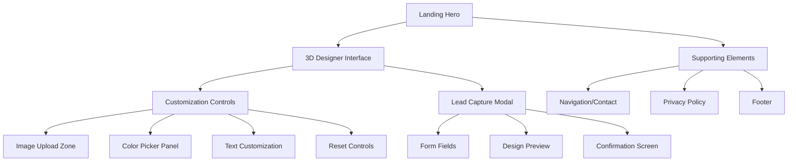
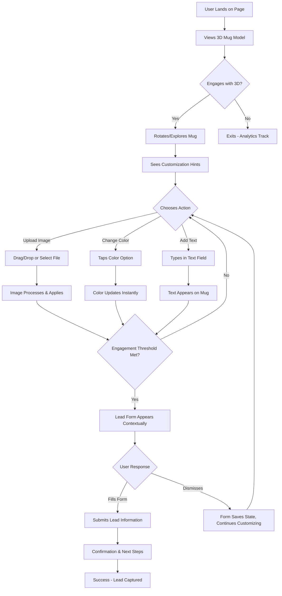

# Custom Ceramic Mug Landing Page UI/UX Specification

## Introduction

This document defines the user experience goals, information architecture, user flows, and visual design specifications for **Custom Ceramic Mug Landing Page**'s user interface. It serves as the foundation for visual design and frontend development, ensuring a cohesive and user-centered experience.

## Overall UX Goals & Principles

### Target User Personas

**Primary Persona - The Curious Explorer:** Small business owners, event planners, and creative individuals (ages 28-45) who are exploring custom mug options for their business or personal projects. They're mobile-first users who value visual confirmation before committing to purchases. They need to see and interact with their design ideas immediately to build confidence in quality and capabilities.

**Secondary Persona - The Quick Decision Maker:** Entrepreneurs and marketing professionals who know they want custom mugs but need to validate design possibilities quickly. They're efficiency-focused, often browsing during work breaks on mobile devices, and convert when they can rapidly visualize their concepts.

### Usability Goals

**Immediate Engagement:** New users can begin meaningful 3D interaction within 10 seconds of page load, with clear visual cues guiding them toward customization.

**Progressive Confidence Building:** Users build increasing confidence through each interaction - rotating the mug (basic trust), uploading their image (medium investment), customizing colors/text (high engagement), leading naturally to lead capture.

**Mobile-First Excellence:** Touch interactions feel as intuitive as handling a physical mug, with 30+ FPS performance maintained throughout the customization process.

**Conversion Optimization:** 8-12% of engaged users (those who upload an image OR customize text AND change color) convert to leads through contextual, non-intrusive form presentation.

### Design Principles

1. **Progressive Engagement Over Aggressive Sales** - Start with delightful, low-commitment interaction that naturally builds toward higher engagement and lead capture
2. **Touch-First, Desktop-Enhanced** - Design every interaction for thumb-friendly mobile use, then enhance with mouse precision for desktop
3. **Immediate Visual Feedback** - Every user action produces instant, satisfying visual changes that build confidence in final product quality
4. **Professional Playfulness** - Balance fun, engaging interactions with visual cues that convey manufacturing quality and business credibility
5. **Contextual Guidance Without Overwhelm** - Use progressive disclosure and micro-animations to guide users through customization without feeling pushy or complicated

### Change Log

| Date | Version | Description | Author |
|------|---------|-------------|---------|
| 2025-09-25 | v1.0 | Initial UI/UX specification creation | Sally (UX Expert) |

## Information Architecture (IA)

### Site Map / Screen Inventory

### Navigation Structure

**Primary Navigation:** Minimal header with logo/brand name, contact link, and optional "How It Works" - designed to not compete with the 3D experience for attention.

**Secondary Navigation:** Context-sensitive controls within the 3D interface - image upload, color selection, text tools - organized in mobile-friendly panels that can collapse/expand.

**Breadcrumb Strategy:** Not applicable for single-page experience. Visual progress indicators show engagement depth instead (e.g., "Choose Color → Add Image → Personalize Text → Get Quote").

## User Flows

### Complete Customization Journey

**User Goal:** Create a personalized mug design and provide contact information to receive a quote

**Entry Points:** 
- Direct landing on homepage via marketing campaigns
- "Design Your Mug" call-to-action button from hero section
- Social media or referral links

**Success Criteria:** User completes meaningful customization (uploads image OR adds text AND changes color) and submits lead form with valid contact information

#### Flow Diagram

#### Edge Cases & Error Handling:
- **File Upload Failures:** Clear error messages with file size/type requirements, alternative upload methods
- **3D Performance Issues:** Graceful degradation to static images with customization preview on slower devices
- **Form Validation Errors:** Inline validation with specific guidance, maintain design context during error states
- **Network Interruptions:** Auto-save design state, retry mechanisms for form submission
- **Browser Compatibility:** Feature detection with fallbacks, clear messaging for unsupported browsers

**Notes:** The trigger for lead form appearance (engagement threshold) is critical - too early feels pushy, too late misses conversion opportunities. The form must feel like a natural next step, not an interruption.

## Wireframes & Mockups

**Primary Design Files:** Figma workspace for collaborative design and interactive prototypes: `figma.com/custom-mug-landing/design-system` (to be created during design phase)

### Key Screen Layouts

#### Landing Hero View
**Purpose:** Create immediate interest and guide users toward 3D interaction without overwhelming them with options

**Key Elements:**
- Compelling headline emphasizing 3D customization capability ("See Your Design Come to Life in 3D")
- Brief value proposition (2-3 lines max) about professional sublimation quality
- Hero 3D mug preview (auto-rotating or simple animation) to demonstrate interactivity
- Prominent "Design Your Mug" CTA button with visual emphasis
- Minimal navigation (logo, contact) that doesn't compete for attention
- Trust signals (quality badges, testimonials) subtly integrated

**Interaction Notes:** The hero 3D preview should be enticing but not fully functional - save the complete experience for the dedicated designer interface. Include subtle hover/touch feedback to hint at interactivity.

**Design File Reference:** `figma.com/design-system/hero-section-variants`

#### 3D Designer Interface (Mobile)
**Purpose:** Provide immersive customization experience optimized for touch interaction

**Key Elements:**
- Full-screen 3D viewport (70-80% of screen real estate)
- Collapsible bottom panel for customization controls
- Floating action buttons for primary actions (upload, color, text)
- Progress indicator showing engagement depth
- Reset button positioned safely away from primary controls
- Context-sensitive help hints that appear/disappear based on user actions

**Interaction Notes:** Touch controls must feel natural - pinch to zoom, drag to rotate, tap to select. Panel slides up from bottom with smooth animation. Controls use large tap targets (44px minimum) with adequate spacing.

**Design File Reference:** `figma.com/mobile-3d-interface/touch-optimized`

#### 3D Designer Interface (Desktop)
**Purpose:** Enhanced experience with mouse precision while maintaining mobile-first design philosophy

**Key Elements:**
- 3D viewport takes center stage with sidebar controls
- Persistent customization panel (doesn't collapse like mobile)
- Enhanced precision controls for text positioning and sizing
- Keyboard shortcuts overlay (optional, triggered by key press)
- Larger preview thumbnails and expanded color palette
- Secondary actions more accessible (undo/redo, save design)

**Interaction Notes:** Mouse controls provide precision that touch cannot - fine text positioning, detailed color selection, hover states for enhanced feedback. Maintain visual consistency with mobile version.

**Design File Reference:** `figma.com/desktop-3d-interface/precision-enhanced`

#### Lead Capture Modal Integration
**Purpose:** Seamlessly transition from creative engagement to business inquiry

**Key Elements:**
- User's custom design prominently displayed as motivation
- Contextual headline ("Love your design? Let's make it real!")
- Minimal form fields (name, email, phone, brief project description)
- Clear privacy policy and data usage consent
- "Get My Quote" primary action with design thumbnail
- Secondary "Keep Designing" option that saves progress

**Interaction Notes:** Modal should feel contextual, not intrusive. Background shows blurred version of their design. Form validation is inline and helpful, not punitive. Easy dismissal preserves creative flow.

**Design File Reference:** `figma.com/lead-capture/contextual-modal-variants`

## Component Library / Design System

**Design System Approach:** Create a lightweight, custom design system focused on 3D interface patterns and mobile-first interactions. Given the startup context and 6-8 week timeline, we'll build essential components rather than adopting a full framework like Material or Bootstrap, allowing for the unique 3D interaction patterns this application requires.

### Core Components

#### 3D Viewport Container
**Purpose:** Standardized container for Three.js scenes with consistent loading states and interaction feedback

**Variants:** 
- Hero preview (simplified, auto-rotating)
- Full designer (complete interaction set)
- Modal preview (static with design context)

**States:** Loading, Interactive, Error, Performance-degraded

**Usage Guidelines:** Always include loading indicators, graceful fallbacks for WebGL failures, consistent touch/mouse event handling across all variants.

#### Touch-Optimized Control Panel
**Purpose:** Mobile-first interface panels that slide in/out with customization options

**Variants:**
- Bottom slide panel (mobile primary)
- Sidebar panel (desktop enhancement)
- Floating overlay (contextual tools)

**States:** Collapsed, Expanded, Loading, Disabled

**Usage Guidelines:** Minimum 44px tap targets, adequate spacing between controls, smooth animation transitions. Panel content must be scrollable when expanded beyond viewport.

#### Smart Upload Zone
**Purpose:** Drag-and-drop file upload with immediate visual feedback and validation

**Variants:**
- Default state (encourages upload)
- Active drag state (visual drop zone)
- Processing state (file conversion)
- Success state (preview thumbnail)
- Error state (clear guidance)

**States:** Idle, Drag-over, Processing, Success, Error, Disabled

**Usage Guidelines:** Clear visual boundaries for drop zones, immediate feedback for all user actions, graceful handling of invalid files with helpful error messages.

#### Color Selection Interface
**Purpose:** Touch-friendly color picker optimized for quick selection

**Variants:**
- Compact palette (5 predefined colors)
- Extended palette (future enhancement)
- Custom color picker (advanced feature)

**States:** Default, Selected, Disabled, Loading

**Usage Guidelines:** Large touch targets with visual selection feedback, immediate preview on 3D model, clear visual hierarchy showing current selection.

#### Contextual Lead Form
**Purpose:** Progressive form that appears contextually based on user engagement

**Variants:**
- Modal overlay (primary)
- Inline panel (alternative)
- Simplified mobile (reduced fields)

**States:** Hidden, Appearing, Active, Submitting, Success, Error

**Usage Guidelines:** Always show user's design as context, inline validation without interrupting flow, clear privacy and next-steps messaging.

#### Engagement Progress Indicator
**Purpose:** Visual feedback showing user's customization progress and engagement depth

**Variants:**
- Subtle progress dots (non-intrusive)
- Step indicator (more explicit)
- Achievement badges (gamification)

**States:** Initial, Progressing, Threshold-met, Complete

**Usage Guidelines:** Encouraging rather than pressuring, tied to actual engagement actions, contributes to lead form trigger logic.

## Branding & Style Guide

### Visual Identity

**Brand Guidelines:** To be developed - recommend creating brand guidelines that balance "innovative 3D technology showcase" with "trusted manufacturing partner" positioning. The visual identity should differentiate from traditional print shops while building confidence in professional quality output.

### Color Palette

| Color Type | Hex Code | Usage |
|------------|----------|-------|
| Primary | #2563EB | Primary CTAs, active states, brand elements |
| Secondary | #7C3AED | Interactive highlights, progress indicators |
| Accent | #F59E0B | Success states, engagement rewards, attention |
| Success | #10B981 | Positive feedback, form success, completed actions |
| Warning | #F59E0B | File size warnings, browser compatibility notices |
| Error | #EF4444 | Upload errors, validation failures, system issues |
| Neutral | #64748B, #F1F5F9, #FFFFFF | Text hierarchy, backgrounds, borders |

### Typography

#### Font Families
- **Primary:** Inter (modern, highly legible across devices and sizes)
- **Secondary:** Poppins (friendly, approachable for headlines and CTAs)
- **Monospace:** JetBrains Mono (technical contexts, file names, code)

#### Type Scale
| Element | Size | Weight | Line Height |
|---------|------|--------|-------------|
| H1 | 2.25rem (36px) | 700 | 1.2 |
| H2 | 1.875rem (30px) | 600 | 1.3 |
| H3 | 1.5rem (24px) | 600 | 1.4 |
| Body | 1rem (16px) | 400 | 1.6 |
| Small | 0.875rem (14px) | 400 | 1.5 |

### Iconography

**Icon Library:** Heroicons (clean, consistent style that works well at small sizes) combined with custom 3D-specific icons for upload, rotate, zoom actions

**Usage Guidelines:** Icons should be functional rather than decorative, with clear meaning that supports user actions. 3D interaction icons need to be immediately recognizable across cultures and technical backgrounds.

### Spacing & Layout

**Grid System:** CSS Grid with 8px base unit spacing system for consistent rhythm and alignment across all components

**Spacing Scale:** 4px, 8px, 12px, 16px, 24px, 32px, 48px, 64px (based on 8px foundation for mathematical harmony and developer efficiency)
